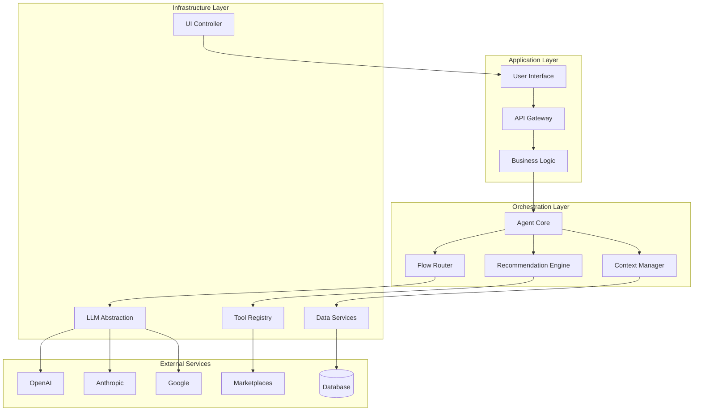

# Design Document: LLM Agnostic AI Agent Architecture

## Overview

This design presents a layered, composable architecture for an LLM agnostic AI agent that provides e-commerce business assistance. The architecture follows proven patterns from production AI systems, emphasizing simplicity, maintainability, and provider independence. The system uses a three-layer approach: Application Layer (business logic), Orchestration Layer (agent coordination), and Infrastructure Layer (LLM providers and external services).

The design prioritizes composable patterns over complex frameworks, following Anthropic's guidance that successful implementations use simple, well-understood building blocks rather than sophisticated abstractions.

## Architecture

### High-Level Architecture



### Layer Responsibilities

**Application Layer**: Handles user interactions, API requests, and high-level business logic coordination.

**Orchestration Layer**: Manages conversation flows, maintains context, and orchestrates tool execution.

**Infrastructure Layer**: Provides abstracted access to LLM providers, tools, and external services.

## Components and Interfaces

### 1. LLM Abstraction Layer

The LLM Abstraction Layer provides a unified interface for different language model providers, following the adapter pattern to ensure provider independence.

```typescript
interface LLMProvider {
  name: string;
  capabilities: LLMCapabilities;
  
  generateText(request: TextGenerationRequest): Promise<TextGenerationResponse>;
  generateWithTools(request: ToolGenerationRequest): Promise<ToolGenerationResponse>;
  streamGeneration(request: StreamRequest): AsyncIterable<StreamChunk>;
}

interface LLMCapabilities {
  maxTokens: number;
  supportsTools: boolean;
  supportsStreaming: boolean;
  supportsFunctionCalling: boolean;
}

interface TextGenerationRequest {
  messages: Message[];
  temperature?: number;
  maxTokens?: number;
  systemPrompt?: string;
}
```

The abstraction layer includes:
- **Provider Registry**: Manages available LLM providers and their configurations
- **Load Balancer**: Distributes requests across providers based on availability and cost
- **Fallback Handler**: Switches to backup providers when primary providers fail
- **Response Normalizer**: Standardizes responses across different provider formats

### 2. Agent Core

The Agent Core orchestrates conversation flows and manages the overall agent behavior using composable workflow patterns.

```typescript
interface AgentCore {
  processUserInput(input: UserInput, context: ConversationContext): Promise<AgentResponse>;
  executeWorkflow(workflow: WorkflowType, parameters: WorkflowParameters): Promise<WorkflowResult>;
  handleError(error: AgentError, context: ConversationContext): Promise<ErrorResponse>;
}

enum WorkflowType {
  PROMPT_CHAINING = 'prompt_chaining',
  ROUTING = 'routing', 
  PARALLELIZATION = 'parallelization',
  ORCHESTRATOR_WORKERS = 'orchestrator_workers',
  EVALUATOR_OPTIMIZER = 'evaluator_optimizer',
  AUTONOMOUS_AGENT = 'autonomous_agent'
}
```

The Agent Core implements workflow patterns:
- **Prompt Chaining**: Decomposes complex tasks into sequential steps
- **Routing**: Classifies inputs and directs to specialized handlers
- **Parallelization**: Executes multiple subtasks simultaneously
- **Orchestrator-Workers**: Dynamically delegates tasks to specialized agents
- **Evaluator-Optimizer**: Iteratively improves responses through feedback loops

### 3. Flow Router

The Flow Router determines which conversation flow to execute based on user intent and context.

```typescript
interface FlowRouter {
  classifyIntent(input: UserInput, context: ConversationContext): Promise<IntentClassification>;
  selectFlow(intent: IntentClassification): ConversationFlow;
  executeFlow(flow: ConversationFlow, parameters: FlowParameters): Promise<FlowResult>;
}

interface ConversationFlow {
  id: string;
  name: string;
  description: string;
  requiredTools: string[];
  expectedInputs: InputSchema[];
  outputFormat: OutputSchema;
  nextStepActions: NextStepAction[];
}
```

Flow categories include:
- **Business Performance Flows**: Revenue analysis, SEO scoring, profitability insights
- **Product Management Flows**: Catalog queries, product optimization, inventory management
- **Marketing Flows**: Campaign creation, email generation, strategy planning
- **Account Management Flows**: Profile management, subscription handling, goal tracking

### 4. Context Manager

The Context Manager maintains conversation state and user context across sessions.

```typescript
interface ContextManager {
  getContext(userId: string, sessionId: string): Promise<ConversationContext>;
  updateContext(context: ConversationContext): Promise<void>;
  clearContext(userId: string, sessionId?: string): Promise<void>;
  persistRecommendations(recommendations: Recommendation[]): Promise<void>;
}

interface ConversationContext {
  userId: string;
  sessionId: string;
  activeProduct?: string;
  activeRecommendation?: string;
  currentFlow?: string;
  businessData: BusinessDataSnapshot;
  recommendations: Map<string, Recommendation[]>;
  conversationHistory: Message[];
  lastUpdated: Date;
}
```

Context scoping includes:
- **User-level context**: Business profile, goals, preferences
- **Session-level context**: Current conversation, active products, recommendations
- **Flow-level context**: Workflow state, intermediate results, error recovery

### 5. Recommendation Engine

The Recommendation Engine generates structured business recommendations with unique identifiers for expansion and tracking.

```typescript
interface RecommendationEngine {
  generateRecommendations(
    productId: string, 
    analysisType: AnalysisType, 
    businessData: BusinessData
  ): Promise<Recommendation[]>;
  
  expandRecommendation(recommendationId: string): Promise<RecommendationDetail>;
  trackRecommendationOutcome(recommendationId: string, outcome: OutcomeData): Promise<void>;
}

interface Recommendation {
  id: string;
  title: string;
  reason: string;
  impactEstimate?: ImpactEstimate;
  priority: Priority;
  category: RecommendationCategory;
  requiredActions: Action[];
}

interface RecommendationDetail extends Recommendation {
  detailedExplanation: string;
  implementationSteps: Step[];
  riskAssessment: RiskLevel;
  timeToImplement: Duration;
  successMetrics: Metric[];
}
```

### 6. Tool Registry

The Tool Registry manages available business tools and their execution, supporting dynamic registration and versioning.

```typescript
interface ToolRegistry {
  registerTool(tool: BusinessTool): Promise<void>;
  getTool(toolId: string, version?: string): Promise<BusinessTool>;
  executeTool(toolId: string, parameters: ToolParameters): Promise<ToolResult>;
  listAvailableTools(category?: ToolCategory): Promise<BusinessTool[]>;
}

interface BusinessTool {
  id: string;
  name: string;
  description: string;
  version: string;
  category: ToolCategory;
  inputSchema: JSONSchema;
  outputSchema: JSONSchema;
  execute: (parameters: ToolParameters) => Promise<ToolResult>;
}

enum ToolCategory {
  BUSINESS_ANALYTICS = 'business_analytics',
  PRODUCT_MANAGEMENT = 'product_management', 
  SEO_OPTIMIZATION = 'seo_optimization',
  MARKETING = 'marketing',
  ACCOUNT_MANAGEMENT = 'account_management'
}
```

## Data Models

### Core Business Entities

```typescript
interface BusinessProfile {
  userId: string;
  businessName: string;
  primaryEmail: string;
  timezone: string;
  connectedMarketplaces: Marketplace[];
  subscriptionPlan: SubscriptionPlan;
  businessGoals: BusinessGoal[];
}

interface Product {
  id: string;
  title: string;
  description: string;
  price: Money;
  cost: Money;
  seoScore: number;
  tags: string[];
  marketplace: Marketplace;
  performanceMetrics: PerformanceMetrics;
}

interface PerformanceMetrics {
  revenue: Money;
  salesCount: number;
  conversionRate: number;
  impressions: number;
  clicks: number;
  profitMargin: number;
  period: DateRange;
}
```

### Conversation Entities

```typescript
interface Message {
  id: string;
  role: MessageRole;
  content: string;
  timestamp: Date;
  metadata?: MessageMetadata;
}

enum MessageRole {
  USER = 'user',
  ASSISTANT = 'assistant',
  SYSTEM = 'system',
  TOOL = 'tool'
}

interface AgentResponse {
  content: string;
  nextStepActions: NextStepAction[];
  uiActions?: UIAction[];
  recommendations?: Recommendation[];
  metadata: ResponseMetadata;
}

interface NextStepAction {
  id: string;
  title: string;
  description: string;
  actionType: ActionType;
  parameters?: ActionParameters;
}
```

## Correctness Properties

*A property is a characteristic or behavior that should hold true across all valid executions of a system—essentially, a formal statement about what the system should do. Properties serve as the bridge between human-readable specifications and machine-verifiable correctness guarantees.*

### Property Reflection

After analyzing all acceptance criteria, I identified several areas where properties can be consolidated to eliminate redundancy:

- **Provider Interface Compliance**: Multiple criteria test that LLM providers conform to the standard interface - these can be combined into comprehensive interface compliance properties
- **Error Handling Consistency**: Various error handling requirements can be consolidated into general error handling properties
- **State Management**: Context and recommendation persistence requirements share common patterns
- **Response Format Consistency**: Multiple criteria test response formatting - these can be unified

### Core Properties

**Property 1: LLM Provider Interface Compliance**
*For any* LLM provider implementation, it must support all required interface methods (generateText, generateWithTools, streamGeneration) and return responses conforming to the standard schema
**Validates: Requirements 1.1, 1.3**

**Property 2: Provider Switching Transparency** 
*For any* valid request, switching between LLM providers should produce functionally equivalent responses without requiring changes to the Agent_Core
**Validates: Requirements 1.2**

**Property 3: Graceful Error Handling**
*For any* system component failure (LLM provider, tool execution, data service), the Agent_Core should provide meaningful error messages and continue operation through fallback mechanisms
**Validates: Requirements 1.4, 3.4, 8.1, 8.3**

**Property 4: Response Format Consistency**
*For any* agent response, it must contain 2-4 specific next-step actions that map to executable functionality
**Validates: Requirements 2.1, 2.2**

**Property 5: Recommendation Structure Compliance**
*For any* generated recommendation, it must have a unique ID, structured format with title and reason, and support expansion to detailed information
**Validates: Requirements 2.3, 5.1, 5.2, 5.3**

**Property 6: Tool Registry Integrity**
*For any* tool registration or execution, the Tool_Registry must maintain schema compliance, support versioning, and validate parameters correctly
**Validates: Requirements 3.1, 3.2, 3.3, 3.5**

**Property 7: Context Persistence and Isolation**
*For any* user session, the Context_Manager must persist conversation state, maintain proper scoping between users, and retrieve relevant context when referenced
**Validates: Requirements 4.1, 4.2, 4.3, 4.5**

**Property 8: Data Service Completeness**
*For any* business data request, the Business_Data_Service must provide access to all required data types (products, sales, metrics) and handle incomplete data appropriately
**Validates: Requirements 6.1, 6.2, 6.4**

**Property 9: UI Integration Consistency**
*For any* UI action command, the UI_Controller must navigate to correct interface elements, pre-populate forms based on context, and provide alternatives when actions fail
**Validates: Requirements 7.1, 7.2, 7.3, 7.4, 7.5**

**Property 10: Configuration Hot Reload**
*For any* configuration change, the system must apply new settings without restart while maintaining existing conversation state
**Validates: Requirements 9.5**

**Property 11: Progress Indication for Long Operations**
*For any* complex business analysis operation, the system must provide progress indicators during execution
**Validates: Requirements 10.2**

**Property 12: Caching Efficiency**
*For any* frequently accessed data, the Context_Manager must implement caching that reduces retrieval time on subsequent requests
**Validates: Requirements 10.4**

## Error Handling

### Error Categories and Responses

**LLM Provider Errors**:
- Connection failures → Automatic fallback to backup provider
- Rate limiting → Queue requests and retry with exponential backoff  
- Invalid responses → Log error and request regeneration
- Timeout errors → Switch to faster provider if available

**Tool Execution Errors**:
- Invalid parameters → Return schema validation error with correction suggestions
- External API failures → Provide cached data if available, otherwise inform user of limitation
- Permission errors → Guide user through authentication or access setup
- Timeout errors → Offer simplified alternative or manual process

**Data Service Errors**:
- Missing data → Explain limitation and suggest data collection steps
- Stale data → Refresh automatically if possible, otherwise warn user
- Synchronization failures → Retry with exponential backoff, fallback to last known good state
- Schema mismatches → Log for debugging, attempt graceful conversion

**Context Management Errors**:
- Session expiry → Gracefully restart conversation with context summary
- Memory limits → Compress older context while preserving key information
- Corruption → Rebuild context from conversation history
- Concurrency conflicts → Use optimistic locking with conflict resolution

### Error Recovery Strategies

1. **Graceful Degradation**: System continues operating with reduced functionality
2. **Automatic Retry**: Transient failures trigger retry with exponential backoff
3. **Fallback Providers**: Switch to alternative LLM providers or data sources
4. **User Guidance**: Provide clear explanations and alternative action paths
5. **State Preservation**: Maintain conversation context during error recovery

## Testing Strategy

### Dual Testing Approach

The system requires both unit testing and property-based testing to ensure comprehensive coverage:

**Unit Tests**: Focus on specific examples, edge cases, and integration points
- Component integration testing between layers
- Specific error condition handling
- Configuration loading and validation
- UI action execution and navigation
- Tool registration and schema validation

**Property-Based Tests**: Verify universal properties across all inputs
- LLM provider interface compliance across different implementations
- Response format consistency across all conversation flows
- Context persistence and retrieval across session boundaries
- Error handling behavior across all failure modes
- Tool execution validation across all parameter combinations

### Property-Based Testing Configuration

- **Testing Framework**: Use Hypothesis (Python) or fast-check (TypeScript) for property-based testing
- **Test Iterations**: Minimum 100 iterations per property test to ensure comprehensive input coverage
- **Test Tagging**: Each property test must reference its design document property using the format:
  - **Feature: llm-agnostic-ai-agent, Property 1: LLM Provider Interface Compliance**
  - **Feature: llm-agnostic-ai-agent, Property 2: Provider Switching Transparency**
  - etc.

### Testing Priorities

1. **Critical Path Testing**: Focus on core conversation flows and LLM provider abstraction
2. **Error Boundary Testing**: Verify all error handling and recovery mechanisms
3. **Performance Testing**: Validate response times and concurrent user support
4. **Integration Testing**: Test end-to-end workflows across all system layers
5. **Security Testing**: Verify context isolation and data access controls

The testing strategy emphasizes that unit tests handle concrete scenarios while property tests verify general correctness across the entire input space, providing complementary coverage for a robust system.